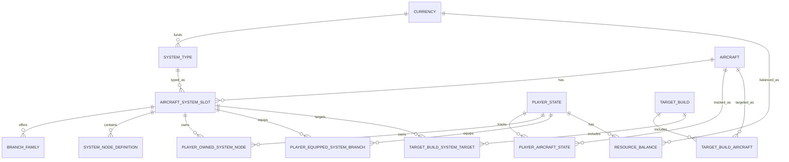
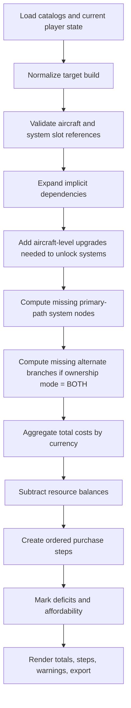

# Upgrades 2.0 Requirements for MetalStorming20

## Executive summary

The public `jpeckham/MetalStorming20` repo is currently a static Blazor WebAssembly planner with a shared `MetalStorming20.Core` math library, a GitHub Pages deployment workflow, and no runtime backend. Its current feature set is narrowly focused on the legacy problem of getting one plane from its current level to plane level 20 while offsetting costs with mastery rewards; the existing UI asks only for current plane level, mastery level, banked parts, and silver, then renders raw need, mastery offsets, remaining need, and a per-upgrade table. citeturn33view0turn39view0turn36view0turn43view1turn43view2turn19view0

Upgrades 2.0 is a materially different domain. Official Metalstorm support says each aircraft now has 20 aircraft levels; system tracks unlock at aircraft level 6; special ability, passive, and mod slots unlock at aircraft levels 8, 12, 16, and 20; and each system track has 8 levels with 12 total nodes, where levels 5–8 are branching choice nodes. Official support also states that both choices at a given branching level can eventually be owned, but only one can be equipped at a time, and that system upgrades consume silver, system parts, and—at later levels—advanced parts. citeturn24view1turn24view3turn24view4turn25view0turn25view1turn25view2

Because the repo is intentionally GitHub Pages–friendly and static-first, the best-fit implementation path is **not** “add a mandatory server and rebuild the app around a database.” The least disruptive path is: keep computation in `MetalStorming20.Core`, add immutable versioned JSON catalogs under `wwwroot/data/v2/`, keep player state and target builds in browser persistence, and add an optional future REST wrapper only if the project later grows beyond static hosting. That preserves the repo’s current operating model while still giving you rigorously structured data tables, migrations, DTO contracts, and planner logic. citeturn33view0turn39view0turn19view0

The exact numeric cost rows below are **not exposed in the official FAQ pages I could fetch**. They come from two sources you supplied in this conversation: the “published chart” image and multiple in-game screenshots across different aircraft and systems. I therefore treat those rows as **seed data with explicit provenance and confidence flags**. The official sources confirm the *shape* of the system; your screenshots and chart provide the *numeric tables*. citeturn24view1turn25view0turn25view1turn25view2

The recommended product outcome is an additive **Upgrades 2.0 planner** with fleet-aware current state, per-aircraft target builds, per-system branch ownership and equipped-branch selection, per-currency deficits, stepwise purchase ordering that respects unlock dependencies, and export formats suitable both for user sharing and for Codex implementation planning. The legacy planner should remain available during rollout as a compatibility route rather than being overwritten on day one.

## What the repo does today and why that matters

The repo README describes the current app as a Blazor WebAssembly planner that forecasts parts and silver needed to finish upgrading a plane and offsets that with mastery rewards, explicitly emphasizing that the UI is static and GitHub Pages–friendly and can be published directly from `wwwroot` without a backend server. The same README also describes the repo structure as `MetalStorming20.Core` for planner math, `MetalStorming20.Web` for the frontend, xUnit tests for calculations, and Playwright tests for UI smoke tests. citeturn33view0

The current `MetalStorming20.Core/Planner.cs` hardcodes a single universal aircraft-upgrade curve plus mastery reward dictionaries, and exposes only four behaviors: `NeedToLevel20`, `FutureMasteryRewards`, `Clamp`, and `GetUpgradeSteps`. There is no notion of systems, system parts, advanced parts, branch choice, duplicate system slots, or multi-aircraft planning in the current core logic. citeturn36view0

The current `Home.razor` page matches that limited domain exactly. It binds only `currentPlaneLevel`, `currentMasteryLevel`, `targetMasteryLevel`, `currentParts`, and `currentSilver`; pressing **Calculate** computes raw aircraft need, after-bank need, future mastery rewards, non-gold and gold paths, and a simple per-upgrade table. This is helpful because it tells us the current app’s strengths: client-side math, deterministic outputs, and simple tabular rendering. It also tells us what must change for Upgrades 2.0: almost the entire domain model above the arithmetic layer. citeturn43view0turn43view1turn43view2

The web host is minimal. `MetalStorming20.Web/Program.cs` only boots the Blazor app and an `HttpClient` rooted at the host base address; there is no API client registration, no persistence service, no auth, and no server integration. That makes the migration simpler in one sense—there is very little infrastructure to unwind—but it also means “DB migration” in this repo really means one of two things: either add a brand-new persistence layer, or keep the app static and version its browser-state schema plus seed JSON catalogs. citeturn39view0

The GitHub Actions workflow reinforces that constraint. The site is published through a GitHub Pages continuous-delivery workflow that builds the Blazor app, deploys static output, and then runs Playwright against the deployed Pages URL. Any architecture that requires a live ASP.NET backend would break the repo’s current operating model unless the hosting model changes. citeturn19view0turn33view0

That leads to the central implementation recommendation for Codex: **treat Upgrades 2.0 as a data-driven client-side planner first**, with a future-compatible API contract, rather than as a server-first rewrite.

## Confirmed Upgrades 2.0 rules and seed cost tables

### Official gameplay rules that the planner must encode

Official Metalstorm support confirms these domain rules:

| Rule | Official status |
|---|---|
| Aircraft have 20 levels | Confirmed |
| Aircraft level 6 unlocks system tracks | Confirmed |
| Aircraft level 8 unlocks special ability slot | Confirmed |
| Aircraft level 12 unlocks passive slot | Confirmed |
| Aircraft level 16 unlocks first mod slot | Confirmed |
| Aircraft level 20 unlocks second mod slot | Confirmed |
| Every aircraft has Fuselage, Engines, Avionics | Confirmed |
| Additional weapon systems depend on aircraft loadout | Confirmed |
| System tracks have 8 levels and 12 nodes | Confirmed |
| Levels 1–4 are single-node trunk levels | Confirmed |
| Levels 5–8 are two-choice branch levels | Confirmed |
| Both choices can eventually be owned | Confirmed |
| Only one choice can be equipped at a time | Confirmed |
| System upgrades use silver + system parts + later advanced parts | Confirmed |
| Advanced parts are required for upgrades 5–8 | Confirmed |
| System parts and advanced parts are shared across aircraft | Confirmed |

These are direct requirements from the official support articles. citeturn24view1turn24view3turn24view4turn25view0turn25view1turn25view2

### Confidence legend for numeric seed data

The numeric tables below use this confidence vocabulary:

| Confidence | Meaning |
|---|---|
| High | User-supplied published chart, plus at least one matching in-game screenshot in this conversation |
| Medium-High | User-supplied published chart only, but consistent with all observed screenshots and chart aggregates |
| Derived | Computed arithmetically from High / Medium-High rows |

### Aircraft upgrade cost rows

The following rows are transcribed from the user-supplied “published chart” image and cross-checked where possible against in-game screenshots from this conversation. These rows are expressed as **from aircraft level → to aircraft level**. The chart also included aggregate checkpoints, which are shown in the following subsection.

| From | To | Silver | Aircraft Parts | Provenance | Confidence |
|---|---:|---:|---:|---|---|
| 1 | 2 | 75 | 25 | Chart | Medium-High |
| 2 | 3 | 150 | 50 | Chart | Medium-High |
| 3 | 4 | 300 | 75 | Chart | Medium-High |
| 4 | 5 | 600 | 150 | Chart + F-106 screenshot | High |
| 5 | 6 | 1,000 | 225 | Chart + F-106 screenshot | High |
| 6 | 7 | 1,300 | 300 | Chart | Medium-High |
| 7 | 8 | 1,625 | 375 | Chart only; one screenshot showed a missing affordance bug for this step | Medium-High |
| 8 | 9 | 2,000 | 450 | Chart + F-5 screenshot | High |
| 9 | 10 | 2,250 | 525 | Chart + prior F-5 screenshot showing target level 10 | High |
| 10 | 11 | 2,600 | 600 | Chart + F-100 screenshot | High |
| 11 | 12 | 2,950 | 650 | Chart | Medium-High |
| 12 | 13 | 3,250 | 725 | Chart | Medium-High |
| 13 | 14 | 3,600 | 800 | Chart + MiG-19 screenshot | High |
| 14 | 15 | 3,900 | 875 | Chart | Medium-High |
| 15 | 16 | 4,250 | 925 | Chart | Medium-High |
| 16 | 17 | 4,550 | 1,000 | Chart | Medium-High |
| 17 | 18 | 4,900 | 1,075 | Chart | Medium-High |
| 18 | 19 | 5,200 | 1,150 | Chart | Medium-High |
| 19 | 20 | 5,500 | 1,225 | Chart | Medium-High |

### Aircraft aggregate rows from the supplied chart

| Range | Silver | Aircraft Parts | Provenance | Confidence |
|---|---:|---:|---|---|
| 1 → 8 | 5,050 | 1,200 | Chart aggregate | Medium-High |
| 8 → 12 | 9,800 | 2,225 | Chart aggregate | Medium-High |
| 12 → 16 | 15,000 | 3,325 | Chart aggregate | Medium-High |
| 16 → 20 | 20,150 | 4,450 | Chart aggregate | Medium-High |
| 1 → 20 | 50,000 | 11,200 | Chart aggregate and sum check | High |

### System upgrade cost rows

For systems, store **progression state** as `0..8`, where `0` means “no nodes purchased yet” and `1..8` are the official system levels. This is the cleanest way to match the supplied chart rows (`0→1` through `7→8`) and avoid UI-level off-by-one bugs.

The row costs below are generic across all observed system types. Your screenshots for fuselage, engines, avionics, cannons, missiles, and rockets all aligned to the same curve.

| From System Level | To System Level | Silver | System Parts | Advanced Parts | Provenance | Confidence |
|---|---:|---:|---:|---:|---|---|
| 0 | 1 | 400 | 200 | 0 | Chart + screenshots across fuselage/engine/avionics/cannon/missile | High |
| 1 | 2 | 600 | 300 | 0 | Chart | Medium-High |
| 2 | 3 | 900 | 450 | 0 | Chart + avionics / rockets screenshots | High |
| 3 | 4 | 1,300 | 600 | 0 | Chart + fuselage / cannon screenshots | High |
| 4 | 5 | 2,100 | 850 | 1 | Chart + fuselage level-5 screenshot | High |
| 5 | 6 | 3,300 | 1,250 | 1 | Chart | Medium-High |
| 6 | 7 | 5,000 | 2,000 | 1 | Chart | Medium-High |
| 7 | 8 | 7,000 | 3,000 | 1 | Chart | Medium-High |

### System aggregate rows

The supplied chart explicitly provided single-branch totals for one system and then full-aircraft totals for aircraft with 4–7 systems, assuming **one chosen branch only** at levels 5–8.

| Scope | Silver | System Parts | Advanced Parts | Provenance | Confidence |
|---|---:|---:|---:|---|---|
| One system, 0 → 8, chosen branch only | 20,600 | 8,650 | 4 | Chart aggregate | High |
| Four systems, chosen branch only | 82,400 | 34,600 | 16 | Chart aggregate | High |
| Five systems, chosen branch only | 103,000 | 43,250 | 20 | Chart aggregate | High |
| Six systems, chosen branch only | 123,600 | 51,900 | 24 | Chart aggregate | High |
| Seven systems, chosen branch only | 144,200 | 60,550 | 28 | Chart aggregate | High |

A useful **derived** row for the planner is full ownership of both branches on a single system. Because only levels 5–8 are doubled, the formula is:

`bothBranches(level 8) = cost(levels 1–4 once) + cost(levels 5–8 twice)`

That yields:

| Scope | Silver | System Parts | Advanced Parts | Provenance | Confidence |
|---|---:|---:|---:|---|---|
| One system, 0 → 8, both branches owned | 38,000 | 15,750 | 8 | Derived from confirmed rows | Derived |

This row is important because the official FAQ confirms that both choices can be owned, while the supplied chart’s totals only cover the one-branch case. citeturn25view0

## Recommended architecture and data model

### Architectural recommendation

The current repo is static-first, and that should remain true for the first Upgrades 2.0 implementation. The recommended shape is:

1. **Keep planner math in `MetalStorming20.Core`** as a new `PlannerV2` domain.
2. **Add immutable catalogs as versioned JSON** in `MetalStorming20.Web/wwwroot/data/v2/`.
3. **Persist player state and target builds in browser storage** with a schema version.
4. **Expose optional future REST endpoints** only as wrappers over the same DTO contracts, not as a hard requirement for GitHub Pages deployment.

That recommendation follows directly from the repo’s current static hosting model and minimal web bootstrap. citeturn33view0turn39view0turn19view0

### Data-model principles

A few modeling principles matter more than almost anything else:

The planner should model **system slots**, not just system types. Official support says all aircraft have fuselage, engines, and avionics, while the remaining weapon systems depend on loadout, and your supplied chart notes that some aircraft can have two systems of the same type. Therefore `Missile` and `Cannons` cannot be unique per aircraft by type alone; the DB key must be an aircraft-specific **slot ID**. citeturn24view4

The planner must separate **ownership** from **equipped branch**. Official support says both choices can eventually be owned but only one can be equipped at a time. That means a single “current system level” integer is not sufficient to represent player state at levels 5–8. You need explicit node ownership and a separate record of which owned branch is currently equipped. citeturn25view0

Resource balances should be modeled as a **global currency ledger**, not per-aircraft balances, because official support says system parts and advanced parts are shared across aircraft as needed. The supplied screenshots also show a single shared aircraft-parts balance. citeturn25view1turn25view2

### New and changed tables

Because the repo has **no persistence schema today**, the tables below are best understood as a normalized domain schema that can be implemented either as JSON-backed records in browser storage or as future SQL tables. There is no existing DB to migrate destructively. The recommended rollout is additive. citeturn33view0turn39view0

#### Catalog tables

##### `currency`

| Field | Type | Key | Notes |
|---|---|---|---|
| `currency_code` | TEXT | PK | `SILVER`, `AIRCRAFT_PARTS`, `ADVANCED_PARTS`, `FUSELAGE_PARTS`, `ENGINE_PARTS`, `AVIONICS_PARTS`, `CANNON_PARTS`, `MISSILE_PARTS`, `ROCKET_PARTS` |
| `display_name` | TEXT |  | User-facing label |
| `sort_order` | INTEGER |  | UI ordering |
| `is_active` | BOOLEAN |  | Future-proofing |

##### `aircraft`

| Field | Type | Key | Notes |
|---|---|---|---|
| `aircraft_id` | TEXT | PK | Stable slug, e.g. `f106_delta_dart` |
| `display_name` | TEXT |  | e.g. `F-106 Delta Dart` |
| `class_code` | TEXT |  | `LIGHT_FIGHTER`, `MEDIUM_FIGHTER`, etc. |
| `hangar_level_unlock` | INTEGER |  | Optional; unspecified in repo |
| `is_owned_supported` | BOOLEAN |  | Whether planner can track it |
| `sort_order` | INTEGER |  | Catalog ordering |
| `data_confidence` | TEXT |  | `UNSPECIFIED`, `SEEDED`, etc. |

##### `aircraft_milestone`

| Field | Type | Key | Notes |
|---|---|---|---|
| `aircraft_milestone_id` | TEXT | PK | e.g. `aircraft_level_6_systems` |
| `aircraft_level` | INTEGER |  | 6, 8, 12, 16, 20 |
| `milestone_type` | TEXT |  | `SYSTEM_TRACKS`, `SPECIAL_ABILITY_SLOT`, `PASSIVE_SLOT`, `MOD_SLOT_1`, `MOD_SLOT_2` |
| `display_name` | TEXT |  | UI text |

##### `system_type`

Use `system_type` rather than `System` to avoid collision with .NET terminology.

| Field | Type | Key | Notes |
|---|---|---|---|
| `system_type_id` | TEXT | PK | `FUSELAGE`, `ENGINES`, `AVIONICS`, `CANNONS`, `MISSILE`, `ROCKETS` |
| `display_name` | TEXT |  | User-facing name |
| `currency_code` | TEXT | FK → `currency.currency_code` | The part type consumed by this system category |
| `is_core_system` | BOOLEAN |  | `true` for Fuselage/Engines/Avionics |
| `allows_duplicate_slots` | BOOLEAN |  | `true` for categories that can repeat on one aircraft |

##### `aircraft_system_slot`

| Field | Type | Key | Notes |
|---|---|---|---|
| `system_slot_id` | TEXT | PK | Stable per-aircraft slot ID, e.g. `f106_missile_main` |
| `aircraft_id` | TEXT | FK → `aircraft.aircraft_id` | Parent aircraft |
| `system_type_id` | TEXT | FK → `system_type.system_type_id` | Category |
| `slot_label` | TEXT |  | Optional label like `Main Missile`, `Internal Cannons`; unspecified if not known |
| `slot_order` | INTEGER |  | Display order |
| `unlock_aircraft_level` | INTEGER |  | Default `6` |
| `max_system_level` | INTEGER |  | Default `8` |
| `catalog_confidence` | TEXT |  | Likely `UNSPECIFIED` initially for many aircraft |

##### `branch_family`

This table stores the **row identity** for the two choice tracks at levels 5–8.

| Field | Type | Key | Notes |
|---|---|---|---|
| `branch_family_id` | TEXT | PK | e.g. `f106_fuselage_A` |
| `system_slot_id` | TEXT | FK → `aircraft_system_slot.system_slot_id` | Parent slot |
| `branch_code` | TEXT | UK with `system_slot_id` | `A` or `B` |
| `display_name` | TEXT |  | Optional label like `Ironclad`, `Acrobat`; often unspecified in repo |
| `sort_order` | INTEGER |  | `1` or `2` |

##### `system_node_definition`

If branch labels and bonuses are known, store them here. If not, the planner can still function with generic A/B labels.

| Field | Type | Key | Notes |
|---|---|---|---|
| `system_node_id` | TEXT | PK | e.g. `f106_fuselage_5_A` |
| `system_slot_id` | TEXT | FK → `aircraft_system_slot.system_slot_id` | Parent slot |
| `system_level` | INTEGER | UK composite | `1..8` |
| `branch_code` | TEXT | UK composite | `NULL` for levels `1..4`, `A/B` for levels `5..8` |
| `display_name` | TEXT |  | Optional node name |
| `bonus_summary` | TEXT |  | Optional UI summary |
| `raw_bonus_json` | TEXT |  | Optional structured bonus payload |
| `is_choice_node` | BOOLEAN |  | `false` for levels `1..4`, `true` for `5..8` |

##### `upgrade_cost`

This is the minimum viable normalized cost table for both aircraft and systems.

| Field | Type | Key | Notes |
|---|---|---|---|
| `upgrade_cost_id` | TEXT | PK | e.g. `aircraft_4_5`, `system_4_5` |
| `upgrade_kind` | TEXT |  | `AIRCRAFT` or `SYSTEM` |
| `from_level` | INTEGER | UK composite | For system rows, `0..7`; for aircraft rows, `1..19` |
| `to_level` | INTEGER | UK composite | For system rows, `1..8`; for aircraft rows, `2..20` |
| `silver_cost` | INTEGER |  | Always required |
| `aircraft_parts_cost` | INTEGER |  | Non-zero only for `AIRCRAFT` |
| `system_parts_cost` | INTEGER |  | Non-zero only for `SYSTEM` |
| `advanced_parts_cost` | INTEGER |  | Non-zero only for branching system levels `5..8` |
| `source_provenance` | TEXT |  | `USER_CHART`, `SCREENSHOT`, `DERIVED`, etc. |
| `confidence_flag` | TEXT |  | `HIGH`, `MEDIUM_HIGH`, `DERIVED` |

#### Player-state tables

##### `player_state`

| Field | Type | Key | Notes |
|---|---|---|---|
| `player_state_id` | TEXT | PK | One active local profile is enough for MVP |
| `display_name` | TEXT |  | Optional |
| `schema_version` | INTEGER |  | Start at `2` for Upgrades 2.0 planner state |
| `created_utc` | TEXT |  | ISO-8601 |
| `updated_utc` | TEXT |  | ISO-8601 |

##### `player_aircraft_state`

| Field | Type | Key | Notes |
|---|---|---|---|
| `player_state_id` | TEXT | PK/FK | To `player_state` |
| `aircraft_id` | TEXT | PK/FK | To `aircraft` |
| `is_owned` | BOOLEAN |  | Planner should refuse upgrade planning for unowned aircraft unless unlocks are later modeled |
| `current_aircraft_level` | INTEGER |  | `1..20` |
| `notes` | TEXT |  | Optional |

##### `player_owned_system_node`

This table is the key to avoiding branch bugs.

| Field | Type | Key | Notes |
|---|---|---|---|
| `player_state_id` | TEXT | PK/FK | To `player_state` |
| `system_slot_id` | TEXT | PK/FK | To `aircraft_system_slot` |
| `system_level` | INTEGER | PK | `1..8` |
| `branch_code` | TEXT | PK | `CORE` for levels `1..4`, `A/B` for levels `5..8` |
| `is_owned` | BOOLEAN |  | Always `true` for inserted rows; present for symmetry |
| `owned_utc` | TEXT |  | Optional |

##### `player_equipped_system_branch`

| Field | Type | Key | Notes |
|---|---|---|---|
| `player_state_id` | TEXT | PK/FK | To `player_state` |
| `system_slot_id` | TEXT | PK/FK | To `aircraft_system_slot` |
| `system_level` | INTEGER | PK | Only `5..8` |
| `branch_code` | TEXT |  | Must be `A` or `B`, and must already be owned |

##### `resource_balance`

| Field | Type | Key | Notes |
|---|---|---|---|
| `player_state_id` | TEXT | PK/FK | To `player_state` |
| `currency_code` | TEXT | PK/FK | To `currency` |
| `amount` | INTEGER |  | Non-negative |

#### Target-build tables

##### `target_build`

| Field | Type | Key | Notes |
|---|---|---|---|
| `target_build_id` | TEXT | PK | Stable ID |
| `display_name` | TEXT |  | e.g. `F-106 Main Build`, `Fleet Max` |
| `mode` | TEXT |  | `CUSTOM`, `MAX_EVERYTHING`, `SELECTED_AIRCRAFT_ONLY` |
| `default_branch_ownership_mode` | TEXT |  | `CHOSEN_ONLY` or `BOTH` |
| `created_utc` | TEXT |  | ISO-8601 |
| `updated_utc` | TEXT |  | ISO-8601 |

##### `target_build_aircraft`

| Field | Type | Key | Notes |
|---|---|---|---|
| `target_build_id` | TEXT | PK/FK | To `target_build` |
| `aircraft_id` | TEXT | PK/FK | To `aircraft` |
| `target_aircraft_level` | INTEGER |  | `1..20` |
| `is_selected` | BOOLEAN |  | Allows storing a fleet build without deleting rows |

##### `target_build_system_target`

| Field | Type | Key | Notes |
|---|---|---|---|
| `target_build_id` | TEXT | PK/FK | To `target_build` |
| `system_slot_id` | TEXT | PK/FK | To `aircraft_system_slot` |
| `target_system_level` | INTEGER |  | `0..8` |
| `ownership_mode` | TEXT |  | `CHOSEN_ONLY` or `BOTH` |
| `target_equipped_branch_json` | TEXT |  | Map of `5..8 -> A/B`; nullable if target level `<5` |
| `is_selected` | BOOLEAN |  | UI convenience |

### Entity relationship diagram



## Planner logic, UI flows, endpoints, and export contracts

### Branch logic and constraints

The planner should explicitly support three related but different ideas:

**Current ownership** means which nodes have been purchased already.  
**Current equip** means which owned branch is active at levels 5–8.  
**Target build** means what will exist after the planner’s recommended purchases are executed.

That separation is mandatory because official support says both branch choices can be owned, but only one can be equipped. citeturn25view0

The required branch rules are:

| Rule | Requirement |
|---|---|
| Levels 1–4 | Single trunk node only, no branch selection |
| Levels 5–8 | One branch choice required to advance |
| Both branch nodes at a level may be owned | Yes |
| Only one branch at a level may be equipped | Yes |
| Switching equipped branch if both are already owned | Zero resource cost; planner should treat this as a state change only |
| Buying both branches | Doubles **only** levels 5–8, not 1–4 |
| If target level `<5` | `buyBothBranches` has no effect |
| If one branch already owned and target mode is `BOTH` | Charge only the missing alternate branch |
| If current state claims an equipped branch that is not owned | Validation error |

The planner should support two explicit ownership modes per targeted system slot:

| Ownership mode | Meaning |
|---|---|
| `CHOSEN_ONLY` | Purchase exactly one branch at each targeted level 5–8 |
| `BOTH` | Purchase both A and B branches at each targeted level 5–8 |

A useful cumulative formula for system costs is:

- `single(L)` = prefix cost to system level `L` using one chosen branch only.
- `both(L)` = `single(4) + 2 × (single(L) - single(4))` for `L >= 5`.

That formula is exact given the confirmed row tables above.

### Delta and purchase-plan algorithm

The planner computation should be deterministic, dependency-aware, and currency-separating.

#### Inputs

A planner run consumes:

- one `PlayerState`
- one `TargetBuild`
- one `ResourceBalances` ledger
- immutable catalogs
- immutable `upgrade_cost` rows

#### Output contract

A planner run should produce:

- normalized warnings / validation messages
- per-aircraft delta summary
- per-system-slot delta summary
- step-by-step purchase sequence
- total required cost by currency
- deficits by currency after subtracting balances
- optional “affordable through step N” marker

#### Core algorithm

The computation flow should be:



#### Detailed logic

For each selected aircraft:

1. Read `current_aircraft_level`.
2. Read `target_aircraft_level`.
3. If any target system slot has `target_system_level > 0`, then force `effective_target_aircraft_level = max(target_aircraft_level, 6)` because official support says system tracks unlock at aircraft level 6. citeturn24view1
4. Add aircraft-level steps from current to effective target using `upgrade_cost` rows of kind `AIRCRAFT`.

For each targeted system slot:

1. Let current owned nodes be the set from `player_owned_system_node`.
2. Let target required nodes be:
   - levels `1..min(targetLevel,4)` as `CORE`
   - levels `5..targetLevel` as one chosen branch per level if `ownership_mode = CHOSEN_ONLY`
   - levels `5..targetLevel` as both `A` and `B` if `ownership_mode = BOTH`
3. Missing nodes are `targetRequired - currentOwned`.
4. Charge each missing node using the generic `SYSTEM` row for that level transition and the currency implied by the slot’s `system_type.currency_code`.
5. If `ownership_mode = BOTH` and a target equipped branch is specified, purchase the intended equipped branch first, then the alternate branch. This ensures a user-followable in-game sequence.
6. If a user only changes `target_equipped_branch_json` and all referenced branches are already owned, emit no cost and no deficit.

#### Ordering of purchase steps

The execution order should preserve unlockability:

1. Aircraft upgrades first, until aircraft level 6 if systems are targeted.
2. System primary-path nodes in ascending system level.
3. Optional alternate branches for already-reached levels 5–8.
4. Remaining aircraft milestone levels beyond 6 if requested.

For multiple aircraft, default ordering should be **by aircraft, then by dependency order**, with an optional “cheapest first” or “priority list” enhancement later.

#### Handling multiple aircraft and duplicate system slots

All totals are accumulated globally by currency. A fleet plan is therefore just the sum of many per-aircraft deltas, but the key correctness requirement is using `system_slot_id`, not `system_type_id`, as the identity of a specific track. That prevents collisions when an aircraft has two cannon or missile systems.

### UI flows and wireframes

A static Blazor app is still the right UI architecture here. The existing one-page calculator should be expanded into a multi-step planner flow.

#### Recommended route structure

| Route | Purpose |
|---|---|
| `/` | New Upgrades 2.0 planner home once rolled out |
| `/legacy` | Existing level-20 mastery-offset calculator preserved temporarily |
| `/upgrades-2` | Optional explicit route during rollout |
| `/about-data` | Optional page explaining confidence / sources |

#### Flow: set current state

The current-state experience should begin with **aircraft selection**, because the entire domain hangs off aircraft → slots → nodes.

```text
┌────────────────────────────────────────────────────────────┐
│ Upgrades 2.0 Planner                                      │
│ [ Legacy planner ] [ New planner ]                        │
├────────────────────────────────────────────────────────────┤
│ Step 1: Current State                                     │
│                                                            │
│ Fleet selector                                             │
│ [x] F-106 Delta Dart   Aircraft level: [ 5 ]              │
│ [x] F-5 Tiger          Aircraft level: [ 8 ]              │
│ [ ] MiG-19 Farmer                                      ... │
│                                                            │
│ For selected aircraft:                                     │
│   Systems                                                  │
│   - Engines   current level [0..8]  owned branches [...]   │
│   - Fuselage  current level [0..8]  owned branches [...]   │
│   - Avionics  current level [0..8]  owned branches [...]   │
│   - Missile   current level [0..8]  owned branches [...]   │
│                                                            │
│ [Import current state JSON] [Paste markdown] [Continue]    │
└────────────────────────────────────────────────────────────┘
```

Requirements:

- current aircraft level input per selected aircraft
- per-system current level shown as **derived** from owned nodes where possible
- explicit branch ownership editor for levels 5–8
- branch equip editor only for owned branches
- duplicate-slot systems shown with their slot label if available; otherwise `Missile #1`, `Missile #2`

#### Flow: set target build

```text
┌────────────────────────────────────────────────────────────┐
│ Step 2: Target Build                                      │
├────────────────────────────────────────────────────────────┤
│ Build preset                                               │
│ ( ) Custom                                                 │
│ ( ) Max everything                                         │
│                                                            │
│ Global toggles                                             │
│ [x] Include all systems on selected aircraft               │
│ [ ] Buy both branches everywhere                           │
│ [x] Single-branch mode by default                          │
│                                                            │
│ Per-aircraft target                                         │
│ F-106 Delta Dart                                           │
│   Target aircraft level [ 20 ]                             │
│   Engines   target level [ 8 ] mode [Chosen only v]        │
│            equip: L5[A] L6[A] L7[B] L8[B]                  │
│   Missile   target level [ 4 ]                             │
│                                                            │
│ [Back] [Continue]                                          │
└────────────────────────────────────────────────────────────┘
```

Requirements:

- “Max everything” sets aircraft level to 20 and all present system slots to 8
- if `buy both branches` is disabled and target system level is `>=5`, the UI must require a chosen equipped branch for each targeted branching level
- if `buy both branches` is enabled, the user must still select the *equipped* branch they intend to run

#### Flow: set resource balances

```text
┌────────────────────────────────────────────────────────────┐
│ Step 3: Resource Balances                                 │
├────────────────────────────────────────────────────────────┤
│ Silver            [ 60306 ]                               │
│ Aircraft Parts    [   576 ]                               │
│ Fuselage Parts    [  2508 ]                               │
│ Engine Parts      [  2504 ]                               │
│ Avionics Parts    [  2507 ]                               │
│ Cannon Parts      [  2598 ]                               │
│ Missile Parts     [  2841 ]                               │
│ Rocket Parts      [   480 ]                               │
│ Advanced Parts    [     7 ]                               │
│                                                            │
│ [Back] [Run Planner]                                       │
└────────────────────────────────────────────────────────────┘
```

Requirements:

- one numeric input per currency
- negative values rejected
- empty values normalize to zero
- balances are global, not per aircraft

#### Flow: show results and purchase plan

```text
┌────────────────────────────────────────────────────────────┐
│ Planner Results                                           │
├────────────────────────────────────────────────────────────┤
│ Totals required                                            │
│ Silver  38,400    Aircraft Parts 225   Engine Parts 950    │
│ Advanced Parts 0                                         ...│
│                                                            │
│ Balances after plan                                        │
│ Silver deficit 900   Aircraft Parts deficit 125            │
│ Engine Parts deficit 450                                   │
│                                                            │
│ Purchase steps                                             │
│ 1. F-106 Aircraft 5→6   Silver 1000  Aircraft Parts 225    │
│ 2. F-106 Engines 0→1    Silver 400   Engine Parts 200      │
│ 3. F-106 Engines 1→2    Silver 600   Engine Parts 300      │
│ 4. F-106 Engines 2→3    Silver 900   Engine Parts 450      │
│                                                            │
│ [Export JSON] [Export Markdown] [Copy share summary]       │
└────────────────────────────────────────────────────────────┘
```

Requirements:

- totals by currency
- deficits by currency
- expandable plan grouped by aircraft and system
- optional filters: by aircraft, by currency, by affordable steps only
- warnings panel for invalid or incomplete target/build assumptions

### User stories

| Actor | Story | Acceptance condition |
|---|---|---|
| New player | As a player with one jet below aircraft level 6, I want the planner to tell me the minimum aircraft upgrades needed before I can start system upgrades. | System targets automatically force aircraft target level ≥ 6. |
| Competitive player | As a player targeting one exact build, I want to choose branches at system levels 5–8 and see only the costs for that chosen path. | Planner supports `CHOSEN_ONLY` mode with explicit branch picks. |
| Completionist | As a player who wants both options unlocked, I want the planner to double only the branching levels, not the trunk levels. | `BOTH` mode charges extra only on levels 5–8. |
| Fleet manager | As a player planning several aircraft at once, I want all costs rolled into one global resource ledger. | Totals and deficits are aggregated across aircraft and currencies. |
| Budget-limited player | As a player with limited silver and part balances, I want to see exactly which currencies I am short on. | Results page shows per-currency deficits instead of one combined number. |
| Build sharer | As a player, I want to export my current state and target build into a shareable markdown/JSON format. | Export includes state, targets, balances, totals, and step order. |

### Static data URLs and optional API endpoints

#### Recommended shipping path: static data URLs

These are the endpoints the current GitHub Pages deployment can support immediately:

| URL | Purpose |
|---|---|
| `/data/v2/schema-version.json` | Catalog version and compatibility info |
| `/data/v2/currencies.json` | Supported currencies |
| `/data/v2/aircraft.json` | Aircraft catalog |
| `/data/v2/aircraft-milestones.json` | Level 6/8/12/16/20 milestones |
| `/data/v2/system-types.json` | System categories |
| `/data/v2/aircraft-system-slots.json` | Aircraft → system-slot mapping |
| `/data/v2/branch-families.json` | Optional branch family labels |
| `/data/v2/system-node-definitions.json` | Optional node names and bonuses |
| `/data/v2/upgrade-costs.json` | All aircraft and system cost rows |

These are not server APIs; they are static JSON contracts.

#### Optional future server API

If the repo later grows beyond static hosting, the same contracts can be exposed under minimal APIs:

| Method | Endpoint | Purpose |
|---|---|---|
| `POST` | `/api/v2/plan` | Compute a planner result from current state, target build, and balances |
| `POST` | `/api/v2/validate` | Validate a current state / target build graph without computing totals |
| `GET` | `/api/v2/catalog/version` | Return current catalog version |
| `GET` | `/api/v2/catalog/*` | Mirror static catalogs |
| `POST` | `/api/v2/export/markdown` | Return markdown summary for sharing / Codex |
| `POST` | `/api/v2/import` | Validate and normalize imported player/target state |

The **Phase 1 recommendation is to implement none of these as real network endpoints**. Instead, implement the DTOs and compute function locally, then add REST wrappers only later if hosting changes.

### JSON contracts

#### Current player state payload

```json
{
  "playerStateId": "local-default",
  "schemaVersion": 2,
  "aircraft": [
    {
      "aircraftId": "f106_delta_dart",
      "isOwned": true,
      "currentAircraftLevel": 5
    }
  ],
  "ownedSystemNodes": [],
  "equippedSystemBranches": [],
  "resourceBalances": [
    { "currencyCode": "SILVER", "amount": 2000 },
    { "currencyCode": "AIRCRAFT_PARTS", "amount": 100 },
    { "currencyCode": "ENGINE_PARTS", "amount": 500 }
  ]
}
```

#### Target build payload

```json
{
  "targetBuildId": "f106-engine-upgrade",
  "displayName": "F-106 to aircraft 6 + engine 3",
  "mode": "CUSTOM",
  "defaultBranchOwnershipMode": "CHOSEN_ONLY",
  "aircraftTargets": [
    {
      "aircraftId": "f106_delta_dart",
      "targetAircraftLevel": 6
    }
  ],
  "systemTargets": [
    {
      "systemSlotId": "f106_engines_main",
      "targetSystemLevel": 3,
      "ownershipMode": "CHOSEN_ONLY",
      "targetEquippedBranch": {}
    }
  ]
}
```

#### Expected planner result payload

This example assumes the F-106 is currently aircraft level 5 with no engine nodes owned, and the player has 2,000 silver, 100 aircraft parts, and 500 engine parts.

```json
{
  "warnings": [],
  "totalsRequired": [
    { "currencyCode": "SILVER", "amount": 2900 },
    { "currencyCode": "AIRCRAFT_PARTS", "amount": 225 },
    { "currencyCode": "ENGINE_PARTS", "amount": 950 }
  ],
  "deficits": [
    { "currencyCode": "SILVER", "amount": 900 },
    { "currencyCode": "AIRCRAFT_PARTS", "amount": 125 },
    { "currencyCode": "ENGINE_PARTS", "amount": 450 }
  ],
  "steps": [
    {
      "order": 1,
      "aircraftId": "f106_delta_dart",
      "scope": "AIRCRAFT",
      "fromLevel": 5,
      "toLevel": 6,
      "costs": [
        { "currencyCode": "SILVER", "amount": 1000 },
        { "currencyCode": "AIRCRAFT_PARTS", "amount": 225 }
      ]
    },
    {
      "order": 2,
      "aircraftId": "f106_delta_dart",
      "systemSlotId": "f106_engines_main",
      "scope": "SYSTEM",
      "fromLevel": 0,
      "toLevel": 1,
      "costs": [
        { "currencyCode": "SILVER", "amount": 400 },
        { "currencyCode": "ENGINE_PARTS", "amount": 200 }
      ]
    },
    {
      "order": 3,
      "aircraftId": "f106_delta_dart",
      "systemSlotId": "f106_engines_main",
      "scope": "SYSTEM",
      "fromLevel": 1,
      "toLevel": 2,
      "costs": [
        { "currencyCode": "SILVER", "amount": 600 },
        { "currencyCode": "ENGINE_PARTS", "amount": 300 }
      ]
    },
    {
      "order": 4,
      "aircraftId": "f106_delta_dart",
      "systemSlotId": "f106_engines_main",
      "scope": "SYSTEM",
      "fromLevel": 2,
      "toLevel": 3,
      "costs": [
        { "currencyCode": "SILVER", "amount": 900 },
        { "currencyCode": "ENGINE_PARTS", "amount": 450 }
      ]
    }
  ]
}
```

### Markdown export structure for Codex

The cleanest export format for Codex is a markdown work-order file that carries requirements, seeds, and contracts in one place.

```md
# Codex Work Order: MetalStorming20 Upgrades 2.0

## Context
- Existing app is static Blazor WASM + Core math library.
- Preserve GitHub Pages compatibility.
- Keep legacy planner during rollout.

## Catalog tasks
- Add currencies seed
- Add aircraft milestones seed
- Add aircraft/system slot catalog
- Add branch-family catalog
- Add upgrade-cost seed rows

## Core tasks
- Add PlannerV2 request/response DTOs
- Add validation engine
- Add delta calculator
- Add purchase-step ordering
- Add deficit calculator

## Web tasks
- Add /upgrades-2 route
- Build Current State flow
- Build Target Build flow
- Build Resource Balances flow
- Build Results + Export flow
- Add local storage versioning

## Tests
- Add cost-row tests
- Add single-aircraft delta tests
- Add branch-ownership tests
- Add duplicate-slot tests
- Add Playwright happy paths

## Seed data
```json
{ "see": "upgrade-costs.json" }
```

## Planner contracts
```json
{ "see": "planner-request.json" }
```

## Acceptance criteria
- Static deployment still works on GitHub Pages
- Legacy route still works
- Upgrades 2.0 planner computes aircraft + system costs correctly
- Results show per-currency deficits
- Exported markdown is stable and human-readable
```

## Validation, testing, performance, and migration

### Edge cases and validation rules

The planner should reject or normalize the following:

| Case | Rule |
|---|---|
| Negative balances | Reject |
| Aircraft target below current level | Reject; downgrade planning is out of scope |
| System target below current owned level | Reject for ownership target; allow equip-only changes if already owned |
| Target system on unowned aircraft | Reject unless aircraft unlock planning is explicitly added later |
| Target system on owned aircraft below level 6 | Auto-upgrade aircraft target to 6 |
| Equipped branch specified for level `<5` | Reject |
| Equipped branch specified for unowned branch | Reject |
| Missing branch choice for targeted `CHOSEN_ONLY` system level `>=5` | Reject |
| `BOTH` mode on target level `<5` | Ignore as no-op |
| Duplicate system-slot IDs | Reject catalog |
| Player owns branch B at level 6 but owns nothing at level 5 | Reject inconsistent state graph |
| Player owns alternate branch only at a level and no primary owned branch at that same level | Reject inconsistent state graph |
| Partial progress within a node | Unsupported; game evidence points to node-level purchases, not fractional progress |
| Missing in-game affordance bug | Ignore UI anomaly; planner uses catalog rows as source of truth |

The last rule is included because one supplied screenshot showed a missing 7→8 affordance despite the chart containing that row; the planner should trust the catalog, not transient client visuals.

### Testing checklist

The existing repo already has unit and Playwright infrastructure, so Upgrades 2.0 should extend that rather than replace it. citeturn33view0turn19view0

#### Unit tests for cost catalogs

| Test | Expected result |
|---|---|
| Aircraft 4→5 cost lookup | Silver `600`, Aircraft Parts `150` |
| Aircraft 5→6 cost lookup | Silver `1000`, Aircraft Parts `225` |
| Aircraft 1→20 sum | Silver `50000`, Aircraft Parts `11200` |
| System 0→1 lookup | Silver `400`, System Parts `200`, Advanced Parts `0` |
| System 4→5 lookup | Silver `2100`, System Parts `850`, Advanced Parts `1` |
| System 0→8 chosen-only sum | Silver `20600`, System Parts `8650`, Advanced Parts `4` |
| System 0→8 both-branches derived sum | Silver `38000`, System Parts `15750`, Advanced Parts `8` |

#### Unit tests for dependency logic

| Test | Expected result |
|---|---|
| Owned aircraft level 5, target engine level 1 | Planner inserts aircraft 5→6 before system step |
| Current state already owns both level-5 branches, target only changes equipped branch | Zero cost |
| Target system level 4 with `BOTH` mode | Same cost as `CHOSEN_ONLY` |
| Target level 5 with `BOTH` mode from system level 4 | Charges `2100×2`, `850×2`, `1×2` |
| Duplicate missile slots on one aircraft | State tracked separately by `system_slot_id` |

#### Integration tests for planner output

| Scenario | Expected result |
|---|---|
| Single-aircraft simple plan | Ordered steps, correct totals, correct deficits |
| Fleet of two aircraft using shared silver | Combined silver deficit reflects both aircraft |
| Invalid branch target | Validation error list populated; no plan emitted |
| Missing catalog branch names | UI falls back to generic `Branch A/B` and still computes |

#### Playwright smoke tests

| Flow | Expected result |
|---|---|
| `/upgrades-2` loads on GitHub Pages | Route resolves and title renders |
| Current-state editor | Can add/select aircraft and enter current levels |
| Target-build editor | Can set target aircraft level and branches |
| Balances screen | Accepts all currencies |
| Results screen | Shows totals, steps, export buttons |
| Legacy route | Still works unchanged during rollout |

### Performance considerations

A fleet planner for 50 aircraft is small by modern client-side standards, but a few design choices will keep the UI instantaneous.

The catalog data is immutable and compact, so it should be loaded once and cached as a singleton in the Blazor app. Prefix sums for aircraft and single-branch system costs should be precomputed on startup. The remaining complexity comes from node-level ownership checks at branching levels, but those are bounded at four levels per system and therefore trivial in practice.

Recommended in-memory caches:

- `AircraftCostPrefix[1..20]`
- `SystemSinglePrefix[0..8]`
- `SystemBothPrefix[0..8]`
- `UpgradeCostByKindAndTransition[(kind, from, to)]`
- `SystemSlotsByAircraftId`
- `NodesBySystemSlotId`

If a future SQL or IndexedDB-backed implementation is added, the critical indices are:

| Table | Index |
|---|---|
| `aircraft_system_slot` | `(aircraft_id)` |
| `branch_family` | `(system_slot_id, branch_code)` unique |
| `system_node_definition` | `(system_slot_id, system_level, branch_code)` unique |
| `player_aircraft_state` | `(player_state_id, aircraft_id)` unique |
| `player_owned_system_node` | `(player_state_id, system_slot_id, system_level, branch_code)` unique |
| `player_equipped_system_branch` | `(player_state_id, system_slot_id, system_level)` unique |
| `resource_balance` | `(player_state_id, currency_code)` unique |
| `target_build_aircraft` | `(target_build_id, aircraft_id)` unique |
| `target_build_system_target` | `(target_build_id, system_slot_id)` unique |

### Migration plan with minimal disruption

Because the repo does not currently have a backend or a persistence schema, the migration should be **additive, route-safe, and reversible**. citeturn33view0turn39view0

#### Phase one

Add new catalogs and core logic without disturbing the existing planner.

Tasks:

- keep existing `Planner` as-is for the legacy page
- add `PlannerV2`, `PlannerRequestV2`, `PlannerResultV2`, and validation classes in `MetalStorming20.Core`
- add versioned seed JSON files under `wwwroot/data/v2/`
- add browser-state versioning (`schemaVersion = 2`)
- add a new route `/upgrades-2`

This phase introduces no breaking changes to the current user-facing route.

#### Phase two

Build the new UI while preserving the legacy route.

Tasks:

- add multi-step current-state / target-build / balances / results pages or one wizard component
- add export/import features
- extend xUnit and Playwright coverage
- keep `/legacy` pointing to the current calculator

#### Phase three

Flip the default route only after validation.

Tasks:

- make `/` point to Upgrades 2.0 planner
- keep `/legacy` for a probationary period
- archive or remove old mastery-dependent copy only after user validation

#### Seed data to import immediately

The minimum confirmed seed set is:

1. aircraft milestones from official support
2. system progression rules from official support
3. aircraft upgrade cost rows from the supplied chart
4. system upgrade cost rows from the supplied chart
5. system aggregate rows from the supplied chart

What is still **unspecified** from the repo and the official support pages examined here:

- full aircraft catalog with stable IDs
- full aircraft → system-slot mapping for every plane
- branch family names for every slot
- node bonus text for every branch node
- any machine-readable official endpoint for those catalogs

That means Codex should implement the domain and planner engine so those catalogs can be filled in incrementally, rather than blocking the entire feature on a complete game-data scrape.

### Codex task list

| Task group | Task |
|---|---|
| Core | Add new Upgrades 2.0 domain records and planner engine |
| Core | Add validation for ownership/equip graph consistency |
| Core | Add prefix-sum helpers and cost lookup services |
| Web | Add static catalog loader service |
| Web | Add browser persistence service with schema versioning |
| Web | Add current-state wizard |
| Web | Add target-build wizard with branch-mode toggles |
| Web | Add balances page and results page |
| Web | Add markdown and JSON export |
| Tests | Add unit tests for cost rows and sums |
| Tests | Add dependency-order tests |
| Tests | Add duplicate-slot tests |
| Playwright | Add route, input, results, and export smoke tests |
| Deployment | Keep GitHub Pages workflow intact; no mandatory backend |

The key design judgment is simple: **treat Upgrades 2.0 as a richer catalog-and-state problem layered on top of the repo’s existing client-side calculation style**, not as a reason to abandon the repo’s static-first architecture. That gives you the lowest-risk path to a correct, testable, and publishable planner.